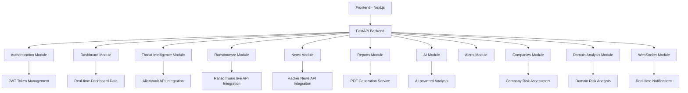

# VAJRA Security Platform - API Flow Diagram

## Overview
This document provides a comprehensive flow diagram of all API endpoints in the VAJRA Security Platform, showing their purposes and data flow.

## API Architecture Flow



## Detailed API Endpoints

### 1. Authentication Module (`/api/auth`)
**Purpose**: User authentication and authorization

```
POST /api/auth/register
├── Purpose: Register new user
├── Input: UserCreate (email, name, password)
├── Output: UserResponse (id, email, name, role, is_active)
└── Database: Creates user in PostgreSQL

POST /api/auth/login
├── Purpose: User login and token generation
├── Input: UserLogin (email, password)
├── Output: Token (access_token, refresh_token, user)
└── Security: JWT tokens for authentication

POST /api/auth/refresh
├── Purpose: Refresh access token
├── Input: TokenRefresh (refresh_token)
├── Output: Token (new access_token, refresh_token, user)
└── Security: Token validation and renewal
```

### 2. Dashboard Module (`/api/dashboard`)
**Purpose: Real-time dashboard metrics and visualization data

```
GET /api/dashboard/summary
├── Purpose: Get overall dashboard summary
├── Output: DashboardSummary (total_attacks, active_threat_actors, critical_attacks, last_updated)
├── Data Source: AlienVault API
└── Usage: Main dashboard cards

GET /api/dashboard/alerts
├── Purpose: Get recent critical alerts
├── Output: List[Alert] (id, title, severity, description, time, source)
├── Data Source: Mock data + AlienVault alerts
└── Usage: Critical alerts component

GET /api/dashboard/attack-map
├── Purpose: Get attack map visualization data
├── Output: List[AttackMapData] (source, target, coordinates, count)
├── Data Source: Mock geographic attack data
└── Usage: Attack map visualization
```

### 3. Threat Intelligence Module (`/api/threat-intelligence`)
**Purpose: Comprehensive threat intelligence data and analysis

```
GET /api/threat-intelligence
├── Purpose: Get overall threat intelligence metrics
├── Output: ThreatIntelligence (score, threatActors, malwareFamilies, iocCount)
├── Data Source: AlienVault API
└── Usage: Threat intelligence dashboard

GET /api/threat-intelligence/trend
├── Purpose: Get threat trend data over time
├── Output: List[ThreatTrend] (date, score)
├── Data Source: Mock historical data
└── Usage: Trend charts and graphs

GET /api/threat-intelligence/actors
├── Purpose: Get threat actor information
├── Output: List of threat actors with details
└── Usage: Threat actor tracking

GET /api/threat-intelligence/industries
├── Purpose: Get industry-specific threat data
├── Output: Industry threat statistics
└── Usage: Industry risk assessment
```

### 4. Ransomware Module (`/api/ransomware`)
**Purpose: Ransomware attack tracking and analysis

```
GET /api/ransomware
├── Purpose: Get recent ransomware incidents
├── Output: List[RansomwareIncident] (id, group, target, country, published, impact, status, description)
├── Data Source: Ransomware.live API
└── Usage: Ransomware incident tracking

GET /api/ransomware/stats
├── Purpose: Get ransomware statistics
├── Output: RansomwareStats (groupsCount, overallVictims, victimsThisYear, victimsThisMonth, trends)
├── Data Source: Ransomware.live API
└── Usage: Ransomware statistics dashboard

GET /api/ransomware/group/{group_name}
├── Purpose: Get incidents for specific ransomware group
├── Output: List[RansomwareIncident] for specific group
├── Data Source: Ransomware.live API
└── Usage: Group-specific analysis
```

### 5. News Module (`/api/news`)
**Purpose: Live cyber threat news from Hacker News

```
GET /api/news
├── Purpose: Get cybersecurity-related news
├── Output: List of news stories (title, url, time_ago, score)
├── Data Source: Hacker News API
├── Filtering: Cybersecurity keyword filtering
└── Usage: Live cyber threat news component
```

### 6. Reports Module (`/api/reports`)
**Purpose: PDF report generation for various modules

```
GET /api/reports/threat-intelligence
├── Purpose: Generate threat intelligence PDF report
├── Output: PDF file (threat_intelligence_report.pdf)
├── Service: PDF generation with black-and-white styling
└── Usage: Download threat intelligence report

GET /api/reports/ransomware
├── Purpose: Generate ransomware PDF report
├── Output: PDF file (ransomware_report.pdf)
├── Service: PDF generation with black-and-white styling
└── Usage: Download ransomware report

GET /api/reports/global-attacks
├── Purpose: Generate global attacks PDF report
├── Output: PDF file (global_attacks_report.pdf)
├── Service: PDF generation with black-and-white styling
└── Usage: Download global attacks report

GET /api/reports/company/{company_id}
├── Purpose: Generate company-specific PDF report
├── Output: PDF file ({company_name}_report.pdf)
├── Database: Company, CompanyThreat, CompanyRiskAssessment tables
└── Usage: Download company risk report

GET /api/reports/executive
├── Purpose: Generate executive summary PDF report
├── Output: PDF file (executive_summary_report.pdf)
├── Service: PDF generation with black-and-white styling
└── Usage: Download executive summary

GET /api/reports/comprehensive
├── Purpose: Generate comprehensive PDF with all modules
├── Output: PDF file (vajra_comprehensive_report.pdf)
├── Service: Combined PDF generation
└── Usage: Download comprehensive report

GET /api/reports/project-overview
├── Purpose: Generate project overview PDF with ransomware focus
├── Output: PDF file (vajra_project_overview.pdf)
├── Service: Project overview PDF generation
└── Usage: Download project overview report
```

### 7. AI Module (`/api/ai`)
**Purpose: AI-powered threat analysis and predictions

```
POST /api/ai/analyze
├── Purpose: AI-powered threat analysis
├── Input: Threat data for analysis
├── Output: AI analysis results
└── Usage: Advanced threat analysis

GET /api/ai/predictions
├── Purpose: Get AI threat predictions
├── Output: Predictive threat data
└── Usage: Threat forecasting
```

### 8. Alerts Module (`/api/alerts`)
**Purpose: Alert management and notifications

```
GET /api/alerts
├── Purpose: Get all alerts
├── Output: List of alerts
├── Database: Alert table
└── Usage: Alert management

POST /api/alerts
├── Purpose: Create new alert
├── Input: Alert data
├── Database: Creates alert in PostgreSQL
└── Usage: Alert creation
```

### 9. Companies Module (`/api/companies`)
**Purpose: Company management and risk assessment

```
GET /api/companies
├── Purpose: Get all companies
├── Output: List[Company]
├── Database: Company table
└── Usage: Company list

GET /api/companies/{company_id}
├── Purpose: Get specific company details
├── Output: Company with risk assessment
├── Database: Company, CompanyRiskAssessment tables
└── Usage: Company detail view

POST /api/companies
├── Purpose: Add new company for monitoring
├── Input: Company data
├── Database: Creates company in PostgreSQL
└── Usage: Company onboarding
```

### 10. Domain Analysis Module (`/api/domain-risk`, `/api/domain-analysis`)
**Purpose: Domain risk assessment and analysis

```
GET /api/domain-risk/{domain}
├── Purpose: Get domain risk assessment
├── Output: Domain risk data
├── Data Source: Domain analysis services
└── Usage: Domain risk evaluation

GET /api/domain-analysis/{domain}
├── Purpose: Detailed domain analysis
├── Output: Comprehensive domain analysis
└── Usage: Deep domain inspection
```

### 11. Notifications Module (`/api`)
**Purpose: User notifications and alerts

```
GET /api/notifications
├── Purpose: Get user notifications
├── Output: List of notifications
└── Usage: Notification center

PUT /api/notifications/{notification_id}
├── Purpose: Mark notification as read
└── Usage: Notification management
```

### 12. Admin Module (`/admin`)
**Purpose: Administrative functions

```
GET /admin/users
├── Purpose: Get all users (admin only)
└── Usage: User management

GET /admin/stats
├── Purpose: Get platform statistics
└── Usage: Platform monitoring
```

### 13. WebSocket Module (`/ws`)
**Purpose: Real-time data streaming

```
WebSocket /ws
├── Purpose: Real-time threat data streaming
├── Events: threat_updates, alert_notifications, dashboard_refresh
└── Usage: Live data updates without polling
```

## Data Flow Architecture

```
┌─────────────────────────────────────────────────────────────┐
│                     Frontend (Next.js)                       │
│  ┌──────────┐  ┌──────────┐  ┌──────────┐  ┌──────────┐   │
│  │ Dashboard│  │ Threat   │  │Ransomware│  │  Reports │   │
│  └────┬─────┘  └────┬─────┘  └────┬─────┘  └────┬─────┘   │
└───────┼────────────┼────────────┼────────────┼────────────┘
        │            │            │            │
        └────────────┴────────────┴────────────┘
                     │
                     ▼
┌─────────────────────────────────────────────────────────────┐
│                  FastAPI Backend (Port 8000)               │
│  ┌──────────────────────────────────────────────────────┐  │
│  │              API Router Layer                         │  │
│  │  Auth │ Dashboard │ Threat │ Ransomware │ Reports    │  │
│  └──────────────────────────────────────────────────────┘  │
│                              │                               │
│                              ▼                               │
│  ┌──────────────────────────────────────────────────────┐  │
│  │              Service Layer                             │  │
│  │  PDF Service │ AlienVault │ Ransomware │ Hacker News   │  │
│  └──────────────────────────────────────────────────────┘  │
│                              │                               │
│                              ▼                               │
│  ┌──────────────────────────────────────────────────────┐  │
│  │              External APIs                             │  │
│  │  AlienVault OTX │ Ransomware.live │ Hacker News      │  │
│  └──────────────────────────────────────────────────────┘  │
│                              │                               │
│                              ▼                               │
│  ┌──────────────────────────────────────────────────────┐  │
│  │              Database (PostgreSQL)                    │  │
│  │  Users │ Companies │ Threats │ Alerts │ Risk Assess  │  │
│  └──────────────────────────────────────────────────────┘  │
└─────────────────────────────────────────────────────────────┘
```

## External API Integrations

### AlienVault OTX API
- **Purpose**: Threat intelligence data
- **Endpoints Used**: 
  - Threat intelligence metrics
  - IOC data
  - Alert data
- **Service**: `services/alienvault_service.py`

### Ransomware.live API
- **Purpose**: Ransomware attack tracking
- **Endpoints Used**:
  - Recent ransomware attacks
  - Ransomware group statistics
  - Group-specific incidents
- **Service**: `services/ransomware_service.py`

### Hacker News API
- **Purpose**: Cyber threat news
- **Endpoints Used**:
  - Top stories
  - New stories
  - Story details
- **Service**: `services/hackernews_service.py`

## Database Schema

### Tables
- **users**: User authentication and profile data
- **companies**: Company information for monitoring
- **company_threats**: Threat data associated with companies
- **company_risk_assessments**: Risk assessment results
- **alerts**: Security alerts and notifications
- **threat_actors**: Threat actor information
- **industries**: Industry-specific threat data

## Security Features

- **JWT Authentication**: Token-based authentication
- **CORS**: Cross-origin resource sharing enabled
- **Rate Limiting**: API rate limiting middleware
- **Security Headers**: HTTP security headers
- **Password Hashing**: Secure password storage

## WebSocket Events

- **threat_updates**: Real-time threat intelligence updates
- **alert_notifications**: New alert notifications
- **dashboard_refresh**: Dashboard data refresh triggers
- **ransomware_updates**: New ransomware incident alerts

## File Downloads

Static file downloads available:
- PowerPoint presentations (.pptx)
- Pre-generated PDF reports
- Project documentation

## Summary

The VAJRA Security Platform API consists of 13 main modules with over 30 endpoints, providing comprehensive threat intelligence, ransomware tracking, company risk assessment, and reporting capabilities. The architecture follows a clean separation of concerns with dedicated service layers for external API integrations and database operations.
